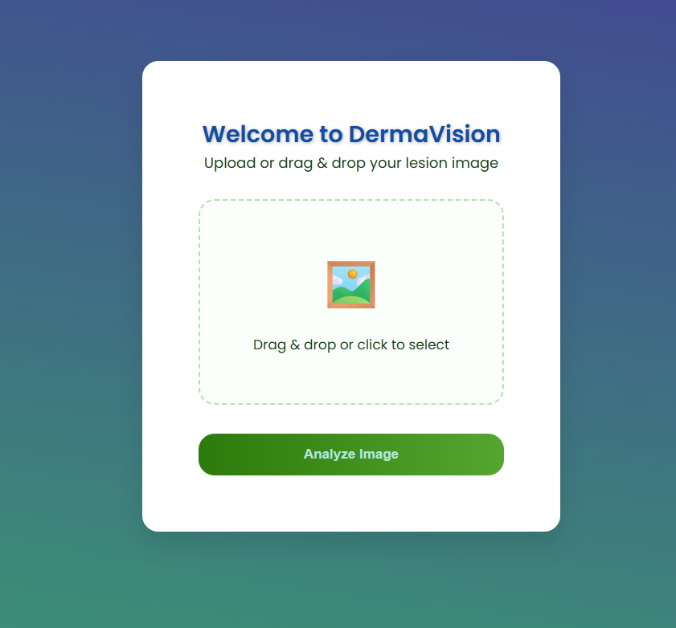
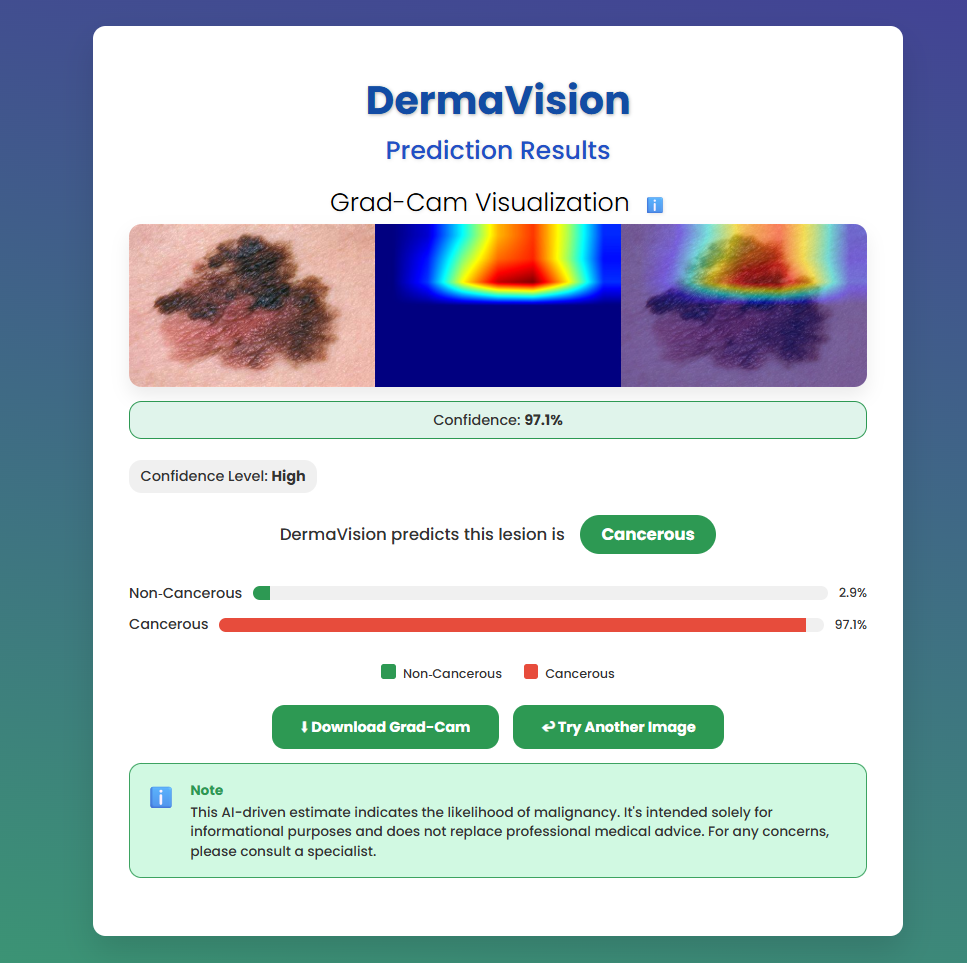

# DermaVision  
**Transparent and Explainable Deep Learning Framework for Skin Cancer Detection**  

  

## Overview  
DermaVision is a web application that leverages **explainable deep learning** to detect skin cancer (melanoma) from dermoscopic images. It combines state-of-the-art CNNs with **Grad-CAM visualizations** to provide:  
- Accurate binary classification (malignant vs. benign)  
-  Heatmaps highlighting clinically relevant features  
-  Confidence scores for predictions  

**Goal**: Support early diagnosis while reducing false positives.  

---

## Features  
-  **Easy Image Upload**: Drag & drop or click to upload   
-  **Explainability**: Grad-CAM heatmaps show decision regions  
-  **Confidence Metrics**: Prediction confidence scores  
-  **Export Results**: Download Grad-CAM visualizations  

---

## Screenshots  
| Upload Interface | Results with Grad-CAM |
|------------------|-----------------------|
|  |  |

---

## Usage  
1. **Upload**: Drag/drop a dermoscopic image  
2. **Analyze**: Click `Analyze Image`  
3. **View**: Check prediction + heatmap  
4. **Download**: Save Grad-CAM visualization  

---

## Technologies  
**Deep Learning**:  
- Models: DiCENet, Xception, EfficientNetV2-M  
- Explainability: Grad-CAM  

**Web Development**:  
- Backend: Flask  
- Frontend: HTML/CSS/JavaScript  

**ML Pipeline**:  
- Transfer learning  
- Data augmentation  
- Image preprocessing  

---

## Disclaimer  
⚠️ **Not medical advice**. Always consult a healthcare professional for diagnoses.  
